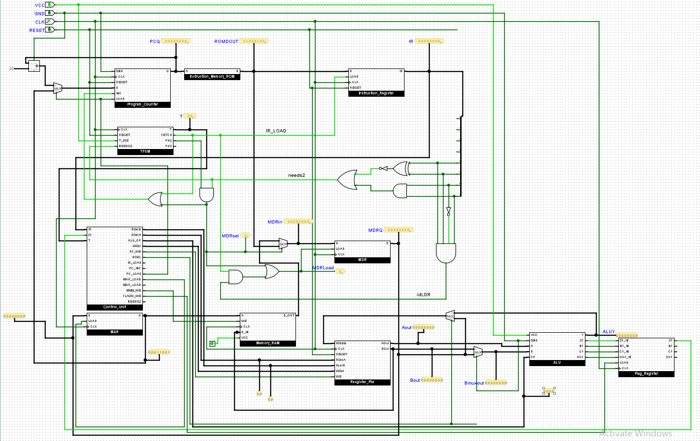

# custom-8bit-cpu-logisim

A custom 8-bit CPU designed and simulated in **Logisim Evolution**, with a
fetch–decode–execute datapath, a custom instruction set, a micro-timing
(T-state) FSM, separate instruction ROM and data RAM, and example programs in
the CPU's own machine code.

> This is a digital-logic simulation built in Logisim Evolution. It is *not* a
> hardware/FPGA project — see [Companion VHDL](#companion-vhdl) and
> [Running it](#running-it) for what is and isn't included.

---

## Architecture overview

The design is an 8-bit, single-bus, von Neumann-style datapath: instructions
live in a dedicated instruction ROM and data lives in a separate RAM, with the
core registers and the ALU exchanging values over a shared 8-bit path. A gate-
based control unit decodes the current instruction together with the timing
FSM's T-state and drives every load/enable line in the datapath.

The full datapath (top-level `main` circuit):



### Subcircuits

All of the following are defined inside [`CPU.circ`](CPU.circ):

| Subcircuit | Role |
|---|---|
| `main` | Top-level integration/test circuit: wires every block together with a clock and reset, and exposes probes (IR, A, B, ALU output, MDR, …) to watch execution. |
| `Program_Counter` | Holds the address of the current instruction; supports load (`PC_LOAD`) and increment (`PC_INC`). |
| `MAR` | Memory Address Register — drives the address presented to memory. |
| `MDR` | Memory Data Register — buffers data moving to/from memory. |
| `Instruction_Memory_ROM` | Instruction memory (ROM) holding the program to execute. |
| `Memory_RAM` | Data memory (RAM), written under `MEM_WE`. |
| `Instruction_Register` | Latches the fetched instruction byte (`IR_LOAD`). |
| `Control_Unit` | Decodes `IR` (8-bit) + `T` (2-bit T-state) into control signals: `PC_LOAD`, `PC_INC`, `MAR_LOAD`, `MDR_LOAD`, `IR_LOAD`, `RF_WE`, `MEM_WE`, `FLAGS_WE`, `BSEL`, `NEEDS2`, the register selects `RSelA`/`RSelB`/`WSel` (2-bit each), and `ALU_OP` (4-bit). |
| `Resgister_File` | Register file (name is spelled `Resgister_File` in the file). Two read ports (`RSelA`, `RSelB`) and one write port (`WSel`), each 2-bit → four addressable registers. |
| `ALU` | 8-bit ALU: inputs `A`, `B` (8-bit) and `OP` (4-bit); outputs result `Y` (8-bit) plus flag outputs `ZF`, `NF`, `CF`, `OOF`. |
| `Flag_Register` | 4-bit flag register latching `ZF` (zero), `NF` (negative), `CF` (carry), `OOF` (overflow) under `LOAD`. |
| `TFSM` | The timing finite-state machine that produces the T-states (see below). |

Per-block schematics are in [`circuits/`](circuits/): `ALU.png`, `CU.png`,
`REG_FILE.png`, `ProgramCounter.png`, `InstructionReg.png`, `FlagReg.png`,
`MAR.png`, `MDR.png`, `RAM.png`, `ROM.png`, `TFSM.png`, and the full `CPU.png`.

---

## Timing / control

Instruction execution is sequenced by the timing FSM (`TFSM` subcircuit, with a
standalone VHDL twin in [`T_FSM.vhd`](T_FSM.vhd)). It steps through T-states:

- **T0 — `fetch`** (`t = 00`): fetch phase.
- **T1 — `ph2`** (`t = 01`): second cycle.
- **T2 — `ph3`** (`t = 10`): an *optional* third cycle, entered only when the
  instruction asserts `needs2` (sampled during T0). Single-cycle-body
  instructions skip T2 and return straight to T0.

The FSM exposes the raw state as a 2-bit `t_out` plus decoded one-hot phase
lines `fetch` / `ph2` / `ph3`. The `Control_Unit` combines this T-state with the
opcode in the `Instruction_Register` to assert the right control lines each
cycle, and raises `NEEDS2` for instructions that require the extra T2 phase.

---

## Instruction set

> **Scope note.** The `Control_Unit` decode is implemented in gates, so a
> *complete* opcode table cannot be recovered reliably from `CPU.circ` alone.
> The instructions below are taken from the author's own notes in
> [`ROM_PROGRAMS`](ROM_PROGRAMS) and cross-checked against the real ROM image
> [`firstcode`](firstcode). Encodings not listed here are marked **TODO
> (author to confirm)** rather than guessed.

### Confirmed instructions

Opcodes are 8-bit; multi-byte instructions take an immediate/address byte that
follows the opcode in program memory.

| Mnemonic | Encoding | Bytes | Operation |
|---|---|---|---|
| `LDI A, imm` | `C4 ii` | 2 | A ← `imm` |
| `LDI B, imm` | `C2 ii` | 2 | B ← `imm` |
| `ADD A, B`   | `81`    | 1 | A ← A + B |
| `JMP addr`   | `F3 aa` | 2 | PC ← `addr` |

Example program documented in `ROM_PROGRAMS` (loads 2 and 8, adds them, then
jumps to address `0x05`):

```
00: C4 02     LDI A, #02
02: C2 08     LDI B, #08
04: 81        ADD A, B
05: F3 05     JMP 0x05
```

### Observed in `firstcode` (not yet documented)

The committed ROM image `firstcode` begins:

```
00: c4 0a c2 05 01 11 21 31 41 51 61 81 00 ...
```

Decoding with the confirmed opcodes: `c4 0a` = `LDI A,#0x0A`, `c2 05` =
`LDI B,#0x05`, and the later `81` = `ADD A,B`. The intervening bytes
**`01 11 21 31 41 51 61`** (and the trailing `00`) use opcodes that are present
in the program but are **not** documented in `ROM_PROGRAMS`.

**TODO (author to confirm):** mnemonics, byte-lengths, and semantics for opcodes
`0x00`, `0x01`, `0x11`, `0x21`, `0x31`, `0x41`, `0x51`, `0x61`, and the full
`ALU_OP` (4-bit) and register-select (`RSelA`/`RSelB`/`WSel`, 2-bit) encodings.

---

## Companion VHDL

[`T_FSM.vhd`](T_FSM.vhd) is a **standalone VHDL implementation of the timing
FSM** — the same T0/T1/optional-T2 behaviour as the `TFSM` subcircuit. It is
provided as a companion/reference only: **it is not embedded in, generated from,
or otherwise integrated with `CPU.circ`.** The Logisim design runs entirely from
the `TFSM` subcircuit; the VHDL file is an independent re-expression of that
state machine (entity `T_FSM`, inputs `clk`/`rst`/`needs2`, outputs `t_out`,
`fetch`, `ph2`, `ph3`).

---

## Running it

This is a Logisim Evolution simulation; you run it inside the Logisim Evolution
GUI, not on hardware.

1. **Install Logisim Evolution.** `CPU.circ` declares it targets
   **Logisim-evolution v4.0.0** — use that version (or newer) for best results.
2. **Open the project:** `File ▸ Open…` → [`CPU.circ`](CPU.circ).
3. **Select the top circuit:** in the explorer pane, double-click **`main`**.
4. **Load a program into the instruction memory:** right-click the
   instruction-memory ROM component → **Load Image…**, and choose a ROM image
   such as [`firstcode`](firstcode). The files are in Logisim's
   `v3.0 hex words addressed` format.
5. **Run it:** enable `Simulate ▸ Ticks Enabled` (or tick the clock manually
   with **Ctrl+T**) and reset the circuit. Watch the probes in `main`
   (`IR`, `Aout`, `Bout`, `ALUY`, `MDR…`) and the T-state FSM advance through
   fetch → decode → execute.

`CPU.lsebdl` is a Logisim Evolution board-description file included with the
project; the design has **not** been deployed to physical hardware.

---

## Repository layout

```
custom-8bit-cpu-logisim/
├── CPU.circ        # The CPU — all subcircuits (open this in Logisim Evolution)
├── CPU.lsebdl      # Logisim Evolution board-description file
├── T_FSM.vhd       # Standalone VHDL of the timing FSM (companion, not integrated)
├── firstcode       # ROM image: example program (v3.0 hex words addressed)
├── ROM_PROGRAMS    # Author's ISA notes + a worked example program
├── circuits/       # PNG schematics of the datapath and each subcircuit
├── LICENSE
└── README.md
```

---

## License

MIT — see [LICENSE](LICENSE). Copyright (c) 2026 Ahmad Zoabi.
